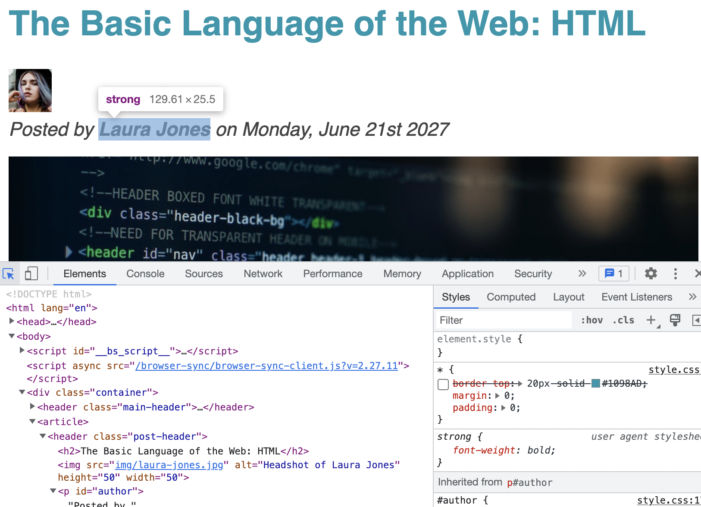

# HTML and CSS3

### index.html
- All web project will by default look for a file called `index.html`

### HTML Basics: 
- `Html` stands for `Hyper-text Markup Language`
- It's a core Web technologies a long with CSS and JavaScript.
- It's used to describe what the content on a web page.
- `Html` is not a programming language, its a `Markup Language` as we use it to describe something.
- `Html` makes use of elements that describe different content such as paragraphs, links, headings, image etc.

### Semantics HTML: 
- Semantics HTML means that a certain HTML element has a meaning attached to it.
- When it comes to elements, we should focus on what the element means and not what it looks like.
- Not All elements are Semantics such as `<b>` and `<i>`.
- Before HTML5 the `div` tag was used to create empty box to group and divide content, however, `div` has no semantic meaning and should be avoided.
- There are several reasons why we want to use elements that have semantic meaning. 
  - search engine optimisation: search engines will better understand our webpages.
  - accessibility: can help screen reading technology better understand our page.

### What is CSS: 
- `CSS` stands for `Cascading Styling Sheets`.
- `CSS` is another core technology of the web. 
- While `HTML` describe the content of a page `CSS` is used to describe the visual style and presentation.

### CSS fragment:
````css
/*
 * h1 selector for every h1 element on the page.
 */
h1 {
   color: blue;
   text-align: center;
   font-size: 20px; 
}
````

- In CSS to apply styles we always need to use a selector. 
- Styles are declared as a property value pair. 
- A group of style Declarations create a Declarations Block.
- The combination of a selector + Declarations Block create a CSS rule.

### CSS placement location:
- There are 3 places (types/locations):
  - Inline CSS: this is done via the use of the style attribute on every element, this method should be avoided.
  - Internal CSS: this is done via the use of the `<style></style>` tag within the `<head></head>` tag, this method should be avoided.
  - External CSS: this is done via the use of external `.css ` files, these files are then included via the `<link href="<location of .style file>" rel="stylesheet"/>`
                  this method is the preferred way

### CSS Colours:
- The most traditional model to represent colour is the `RGB` model.
- In `RGB` model every colour can be represented by the combination of **R**ed **G**reen **B**lue colours.
  - In the RGB model **Red = 255**, **Green = 255** and **Blue = 255** will create **white**
  - In the RGB model **Red = 0**, **Green = 0** and **Blue = 0** will create **black**
- In CSS we have two ways of representing the GRB model.
  - RGB/RGBA notation: 
    - RGB: this notation makes of the `rgb(0, 255, 255)` function within css.
    - RGBA: **A** stands for alpha which control the **transparency**, `rgba(0, 255, 255, 0.3)` = a given colour with a given transparency. 
  - HEX-DECIMAL notation: this notation we dont make use of the `rgb(..)` functions, in stead we use a scale from **0** to **FF** which translates into **0** to **255** in base **10**.
                          For example **#00ffff**, this notation is the preferred notation.

### Pseudo-Classes:
- Pseudo-Classes can be used to change CSS properties based on a state as well a html structure. 
- We should use Pseudo-Classes where applicable over JS. 

### Pseudo-Element:
- Pseudo-elements are elements that dont actually exit in the HTML source code but can be selected and styled in CSS.
- An Example of a pseudo-elements are like the first letter of a paragraph or even the fist line of a paragraph.  

### 5 Rules of CSS: 

#### 1) Multiple Selectors: 
- When we have multiple selectors all rules to the same element all rules will be applied, 
  however, if there are conflicting CSS properties between the rules, property order kicks in.   
- **Id** selectors have the highest priority, if there are multiple **Id** selectors then the last rules properties get applied for conflicting properties.  
- **Class** or **Pseudo-Class** selectors have the 2nd highest priority, if there are multiple **Class** or **Pseudo-Class** selectors the last selectors properties will get applied for conflicting properties.
- Element selector if there are multiple element selectors the last selectors properties will get applied for conflicting properties.
- Universal Selector (*) has the lowest priority out of all selectors, however, its primary use case is apply properties that cant be inherited to all element.    
- The above priority rules are valid for when CSS rules are described in an external CSS class.
- In-line styles via the `styles` attribute has higher priority the CSS rules defined within an external CSS file - however, we should never use in-line styles. 
- As a last resort we can use the `important!` declaration, however, this is a hack and should be avoided.


#### 2) Inheritance: 
- Inheritance within CSS is a mechanism by which some styles (properties) get their values inherited from parent elements to child elements - Inheritance only makes sense when we're talking about element selectors.  
- Not all properties are applicable for inheritance, most properties about text can be inherited. 
- Inherited property is very easily overwritten by any rule which has a value for that same property - this means inherited rules have the lowest priority.
- Inheritance is a very powerful mechanism and can be used to provide consistent stying for child elements for the same parent element. 
- For properties that CANT be inherited we make use of the universal selector.  

#### 3) Box Model:
- The box model defines how elements are displayed on the webpage and how they are sized. 
- Every element on a page can be viewed as a **rectangular box**, each box can have **content**, a **board** and **space** **inside** and **outside** of it, all these component are the visual part of the element. 
  - **Content**: the stuff within the box, using CSS we can control the contents dimensions height (**using the height property**) and width (**using the width property**). 
  - **Border**: the boarder goes all around the element. The board is still considered within the element, however, the border is the outer most part of the element. 
  - **Padding**: padding is the white space between the content and the boarder. The Padding is still within the box model. Padding is used to create empty space within the element.
  - **Margin**: margin is used to create empty space around the element (outside of the element), in practice margin is used to create space between elements on the page.
- **Border**, **Padding** and **Margin** components are all optional and do not need to be specified.
- **content**, **padding** and **board** component are the visual part of the element.
- The **Fill Area** (visible part of the element), represent the area that gets filled with **background-colour** or **background-image**, this consists of the **Content**, **Padding** and **Boarder**. 


- **Margin Collapsing** happens when two margins share the same space, the smaller margin will collapse and no longer render.
- The Box model behaviour can be changed using CSS to something called **Border-Box**.
- **Border-Box** is enabled on a element by setting the **box-sizing = border-box**
- **Border-Box** makes the content go from side of the border to the other side, this means the **border** and the **padding** share same space,
  increasing **border** and/or **padding** will reduce the content size automatically. 


#### 4) Types Of Boxes: 
- CSS has different types of boxes depending on the element: 
  - ### In-Line Box: 
    - An in-line box is a box where the content occupies the exact amount space they need - the box width and height is the exact size as the contents dimensions.
    - These Boxes do not create line-break, this means they can be stacked horizontally (side-by-side with other **In-Line** elements).
    - The **In-Line** box elements **NEVER** create vertical space only horizontal space. 
    - Both **Padding and Margins** can only be adjusted left and right, top and bottom can be adjusted. 
    - The **widths and height** attributes have no impact. 

  - ### Block-Box:
    - Also referred to as **block-element elements**, block-level elements occupy all the width space they can relative to the parent element. 
    - They in short create line brakes after the element. 
    - The effect of this is that they can be side-by-side with one another. 
    - These Box types stack vertically by default.
    - Most elements are block level elements.

  - Using CSS we can actually change the **In-Line** boxes to **Block-Level** boxes using the **display** property set to the value of **block**,
    we can do the inverse as well. 
  - ### In-Line-Block Box: 
    - This is a hybrid Box, **In-Line-Block Box** behave like **In-Line Box** from the outside but behave **Block-Element Box** from the inside.
    - So what this means, they inherit the **In-Line Box** behavior of only taking the exact space they need therefore they don't cause line break. 
      From the **Box-Element box** they inherit the **box model** behavior so **width**, **height**, **padding** and **margins** cant be adjusted same as on **Block-Element**.
    - This box combines best of both worlds. 
    - The CSS property for this is **display = inline-block**.

#### 5) Positioning-Modes (Absolute Positioning):
- CSS has several position modes, but there are a few that a more important than others.
- **Normal Flow**:
  - this is the default positioning of element on the page - **Position = relative**. 
  - it is said that the elements are `in flow`, this means that the elements are laid out according to their order in the HTML source code.  
- **Absolute Positioning**:
  - This positioning mode allows us to **absolute** position elements anywhere on the page - **Position = absolute**.
  - it is said that such elements are `out of flow`. 
  - this mode removes the impact of surrounding the elements and can even overlap other elements. 
  - In this mode the position of the element is relative to the parent container element. 


### What is a layout?:
- In web design and Web Development a layout is referred to the way different elements on the page are arranged.  
- A layout gives the page a visual structure. 
- Building a layout is all about arraying page elements into a visual structure, instead of simply having then placed one after another (normal flow).

### Types of layouts: 
- There are 2 types of layouts:
  - **Page Layout**: 
    - This type of layout is the arrangement of the components (group or a collections of elements) on the page.
    - The larger components themselves will also have some form of a layout arranging their collection of elements.
  - **Component Layout**:
    - Component layout is the internal arrangement of the collections of elements that create the large component, 
      they are arranged to provide visual structure for the component. 

#### Float Layout: 
- This method for creating layout is getting outdated and is considered deprecated. 
- This is better to make use of **Flex Box** and/or **CSS Grid** instead, however, in some cases **Float Layout** can be used. 

#### Flex Box Layout:
- This Method is a more modern way of building layouts. 
- Its primary used to layout elements in a 1-dimensional row, making it great option for component layouts. 
- The most basic definition of a flex box is that it is a set of related **CSS properties** for creating **1-dimensional layout**. 
- The idea behind flexbox is that its a collection of **CSS properties** that can be used to help divide empty space between child elements with a given container - - by using these **CSS properties** we get the browser to do a lot of heavy lifting work for us.

#### Terminology: 
- The element that is acting as the container is called **flex container** - to create a flex container we just need to set the **display** property to **flex**.
- The child elements within the  **flex container** are called **flex items**. 
- The direction the **flex items** are **laid out** is called **main axis**, the other axis is called **cross axis**.


- The **main axis** and **cross-axis** can be inverted. This feature is very powerful as we can create a 1 dimensional table grid.


#### CSS Grid Layout:
- This method can be used for 2-dimensional grid, this makes it perfect for a complex component layout and/or a page layout.__ 
- The container element is referred to as the **Grid Container** and the child elements are referred to as **Grid Items**. 
- **CSS Grids** are set of **CSS properties** that can be used to create **2-dimensional layouts**. 
- **CSS Grids** are used to **divide container elements** into **rows** and **columns**.

#### Terminology: 
- The container element is referred to as the **Grid Container**
- The child elements are referred to as **Grid Items**.
- The Grid consists of two axis **row axis** and **column axis**. 


- The **Grid cells** are the areas within the were element can fill, cells can remain empty if need be.
- The **Grid cells** don't need ot be filled entirely, a element can be smaller than the **Grid cell** area. 


